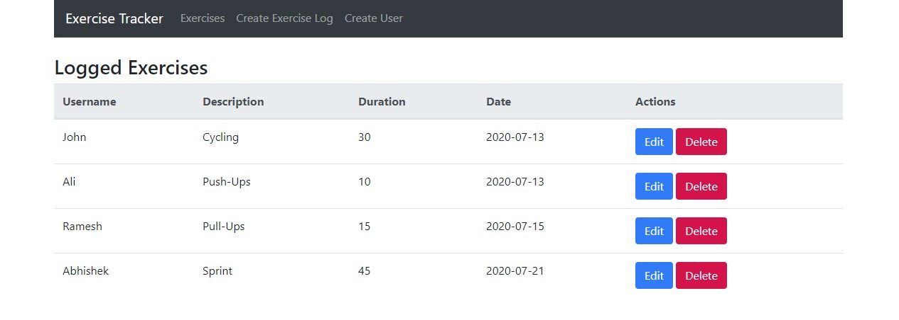

# Exercise Tracker Application

The application is built using the MERN Stack and can be used to log exercise entries. Head over to `Create User` in the nav bar and `Create your own Exercise Log` and check out others logs as well.

To use this project:

- Clone this repository.
- Go into the project directory.
- Go to your terminal and enter: `cd backend` followed by `npm i` and then `nodemon server.js`
- Open up another terminal and enter: `cd frontend` followed by `npm i` and then `npm start`
- Enjoy experimenting.

Thank You!
